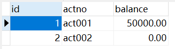

# Bank-Account-Transfer-System
A Bank-Account Transfer System. I save here for learning MVC.

使用Servlet搭建银行账户转账系统，采用MVC架构模式，仅用于学习使用。

项目模块说明：
`bank-mvc-001`：不使用MVC架构实现简单的系统

`bank-mvc-002`：使用简单的MVC架构，仅以类来区分三层架构

`bank-mvc-003`：解决事务问题

`bank-mvc-004`：引入ThreadLocal解决线程问题

`bank-mvc-005`：将不同功能的类放在不同的包下

`bank-mvc-last`：层与层之间面向接口编程

`bank-mybatis-001`：在银行转账系统中引入Maven，使用MyBatis框架，使用接口代理机制

数据库表，数据库名为`mvc`：

---

版本说明：
* JDK17
* IDEA 2022.1.4
* MySQL 8.0.27
* Tomcat 10.0.12
